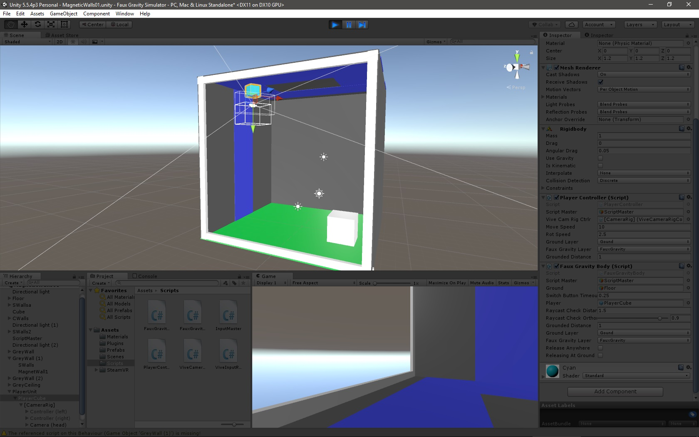

## Magnetic Walls ##

###### _Last checked with Unity 5.5.4p3_ ######

This system for magnetic walls allows Unity `GameObject`s to be affected by alternate sources of gravity. In fact, it is not limited to orthogonal walls but rather can be applied to any surfaces you desire. It was heavily influenced by Sebastian League's [tutorial video on faux gravity](https://www.youtube.com/watch?v=gHeQ8Hr92P4); I expanded it to apply to multiple surfaces. It was originally created for use in _Fred's Happy Factory_, a team-based course project for Virtual Reality at the University of Arkansas at Little Rock in fall 2016, but it is meant to be generally applicable.

As with the other Unity tools I've posted here, the `Assets` directory contains all of the assets that will be loaded if you import `MagneticWalls01-Assets.unitypackage` into a Unity project; this includes the sample scene "MagneticWalls01", in `Assets/Scenes/`.

This scene contains a simple, partially enclosed room. The player can walk on the blue "magnetic" walls and ceiling by approaching and facing them and then pressing the space bar. Press R to return to the spawn point in an upright orientation. (The scene currently contains elements intended for HTC Vive support, but I was never able to implement this support fully. The way in which the Vive determines the player's position is incompatible with what I have programmed, as I initially developed this system for regular keyboard controls.)

* * *

### How to Build Magnetic Walls ###

1. Place your floor. This object must have a rigidbody and collider and be tagged as "Floor" with the layer "Ground". This object is used to determine when faux-gravity bodies are grounded.

2. Place your magnetic walls or other faux-gravity surfaces. These must have the `FauxGravityAttractor` script attached to them. You can select which direction is up for each of them as the positive or negative direction of any of its axes. You are free to adjust the value of `Fgrav` and `Rot Speed`, but -10 and 10, respectively, seem to work well. Add your floor object as the `Floor`.

3. Add the `ViveInputReader` script to each of the Vive controllers. Add the `ViveCameraRigController` script to the Vive Camera Rig.

4. Add the `InputMaster` script as a component to some object in the scene. I usually make a "ScriptMaster" to hold scripts that do not belong to any particular game object. At the very least, ensure that `Using Keyboard Input` is checked. Add the left and right Vive controllers for `Vir Left` and `Vir Right`, respectively.

5. Add your player in the style of the `PlayerUnit` prefab, an empty player unit, parent of the actual player object, itself parent of the Vive camera rig.

6. Go back to the Vive Camera Rig. In the `Vive Camera Rig Controller` component, add the player object as `Player`, the object holding `InputMaster` as `Script Master`, and the Rig's own "Camera (head)" child as `Camera Head`.

7. Again back to the player object, add the `PlayerController` script. Add "ScriptMaster"—or whichever object you attached `InputMaster` to—as the `Script Master`. Add the Vive Camera Rig as `Vive Cam Rig Ctrlr`. You are free to set `Move Speed` and `Rot Speed`, but I have found 10 and 2.5, respectively, to work well. Set `Ground Layer` as `Ground` and `Faux Gravity Layer` as `FauxGravity`. I suggest entering 1 for `Grounded Distance`.

8. Still at the player object, add the `FauxGravityBody` script. Add the object holding `InputMaster` as `Script Master`, the floor object as `Ground`. Set `Switch Button Timeout`, in seconds, to a high enough value so that the player can release their finger from the interact button after activating faux gravity without instantly releasing, if that option is selected; I find 0.25 to be a good value. Set `Player` as the object the script is attached to. You are free to set `Raycast Check Distance`, `Raycast Check Orthogonality`, and `Grounded Distance` as you see fit; I find 1.5, 0.9, and 1, respectively, to work well. Set `Ground Layer` to `Ground` and `Faux Gravity Layer` to `FauxGravity`. Check `Release Anywhere` if you want the player to be able to release from their faux-gravity surface back to regular gravity at any time by pressing the interact button; be warned that this makes transitioning to further faux-gravity surfaces tricky. Do not worry about `Releasing At Ground`: this is used internally to keep track of whether the player is releasing from a faux-gravity surface right next to the ground or from a height.

9. Start the scene. Default keys are arrows and WASD for movement, space bar for the interact button, and R to reset to the player's starting transform.

Writing out these instructions makes me realize how unnecessarily complicated they are. I will work on streamlining this feature in the future, most likely by abandoning the Vive input.