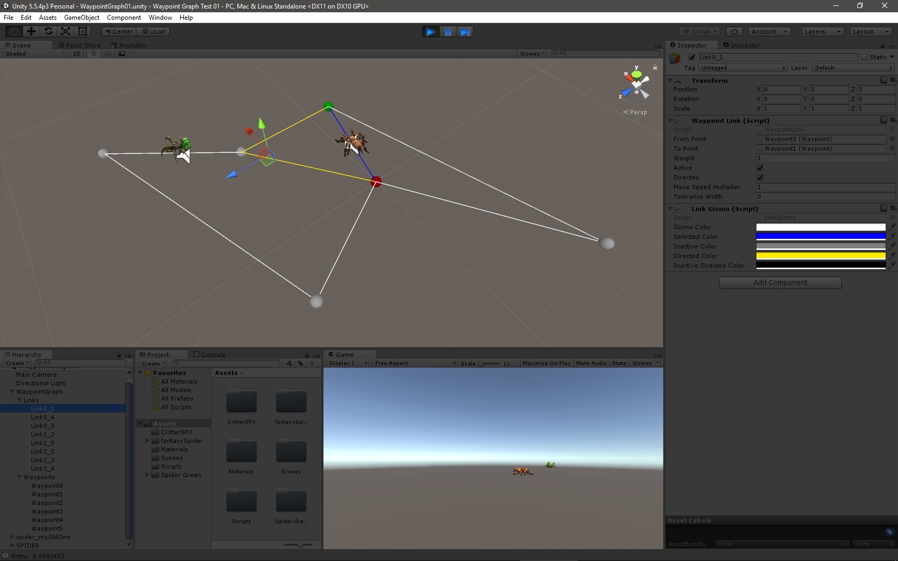
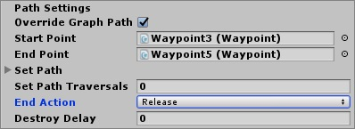
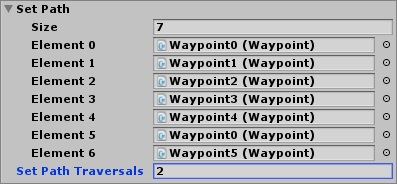

## Waypoint Graph ##

###### _Last checked with Unity 5.5.4p3_ ######

This waypoint graph system exists to facilitate the movement of `GameObject`s in Unity among sets of points in generally unobstructed straight lines. It was created for use in _Fred's Happy Factory_, a team-based course project for Virtual Reality at the University of Arkansas at Little Rock in fall 2016, but it is meant to be generally applicable.

As with the other Unity tools I've posted here, the `Assets` directory contains all of the assets that will be loaded if you import `WaypointGraph01-Assets.unitypackage` into a Unity project; this includes the sample scene "WaypointGraph01", in `Assets/Scenes/`.

This scene contains two different spiders (both available free on the Asset Store) that move around on a small graph (five waypoints connected by eight links). The brown spider moves on a set path (0, 1, 2, 3, 4, 0, 5, repeat) and generates different audio clips depending on whether it's walking or stationary. The green spider moves about randomly and has had its `AudioSource` muted (because both spiders grumbling at once was too annoying). Note how they will not collide with each other; rather, the set-path brown spider waits for the green one to move if necessary, while the randomly moving green one never tries to move to a waypoint that the brown one either occupies or is headed toward.

If you start a project from scratch, be sure to include all of the scripts: `AbstractGizmo`, `AbstractGizmoEditor`, `GraphGizmo`, `GraphTraverse`, `LinkGizmo`, `Pair`, `RAList`, `Vector3Eq`, `Waypoint`, `WaypointGraph`, and `WaypointLink`. `Vector3Eq` is a wrapper for `Vector3` that implements `IEquatable`, which was necessary to get it work in a `RAList` (random-access list); regarding this latter class, I built it to compensate for some flaw I perceived in the standard `List`, but I cannot remember what that was, and it may be entirely unnecessary. It is possible that I will replace `RAList`s with `List`s in the future, but for now, things are working fine.

* * *

### How to Build a Waypoint Graph ###

1. Drag waypoints into the scene from the `Prefabs` folder and place them where you want them. Name them however you wish, but I suggest numbers or letters, which are easy to keep track of.

2. Drag links into the scene from the `Prefabs` folder. Coordinates do not matter. A naming convention as I've used ("Link[from]\_[to]") is probably the best for legibility. Drag waypoints in as `From Point` and `To Point`. If you select `Directed`, the link is one-way, from `From Point` to `To Point`. `Weight` determines the likelihood that the link will be randomly selected for travel; it is not limited to the range [0, 1] but rather is given a probability equal to its value divided by the sum of all link weights for a given waypoint. You can set a `Move Speed Multiplier` other than 1 if you wish.

3. Drag a waypoint graph in from the `Prefabs` folder. Place all links under the `Links` object and all waypoints under the `Waypoints` object as children. To ensure that the gizmos render correctly, keep `Links` above `Waypoints` in the hierarchy; you may also need to close and reopen your project to see the effect. You can specify a start point and end point for the graph by setting `Start Point` and `End Point`, respectively. You can also specify a set path of waypoints.

   White/light grey spheres represent active waypoints; dark grey are inactive; selected waypoints are blue. White lines are active undirected links, while yellow are active directed; grey lines are inactive undirected, and black are inactive directed; blue is selected. When a link is selected, its termini are also highlighted: blue for an undirected link, or red for a directed link's `From Point` and green for its `To Point`. This works best when you only select one link at a time. You can change these colors in the properties for `Graph Gizmo` and `Link Gizmo`.

5. Add the `GraphTraverse` script to an object you want to move through the graph. Attach the graph object by dragging it into the `Graph` field in the Inspector. You may override the graph's path settings for each object; note that any specified `Start Point`, `End Point`, and `Set Path` will only take effect if `Override Graph Path` is selected.

6. Hit Play and watch your traversing object move around the graph. Either that, or something will break, and you'll yell at me.

* * *

#### UPDATE 16 Nov 2016 ####

You can now implement a set path using the correspondingly named public array of `Waypoint`s. Drag the waypoints in like you did for the links. The path is designed to loop, so be sure the last `Waypoint` in the array is connected to the start point. If you use a set path, the first point on that path overrides the `StartPoint`. You cannot force movement in the wrong way along a directed link.

Also, a link is now occupied when someone is on it. There should be no collisions/clipping unless two traversing objects are on two different but very close paths. It is possible to create a deadlock with the wrong combination of termini (nodes with only one link) and set paths; nevertheless, a random traverser (one without a set path) is set to time out after waiting for a link for 3 seconds and pick another one. The wait timeout is configurable as a public member in `GraphTraverse`. You can set the `Uses Occupied Links` flag in `GraphTraverse` if you want the object to ignore other objects on the graph.

Finally, while moving across a link, position is determined by how far an object has traveled on that link instead of how much time it has spent on it. In most cases, this won't matter, but it allows you to stop an object mid-link (with `Halt()`; use `PermitToMove()` to start it moving again; you can also manipulate the `stopped` member directly); this may help to avoid collisions if, say, the traverser is surrounded by a proximity trigger. Note that a side effect of this is that dynamically expanding or contracting the length of the link affects the object's movement speed, as length is calculated in `Start()`. So if you need to change the position of a `Waypoint`, be sure to call `RecalculateLength()` on every link attached to it.

* * *

#### UPDATE 17 Nov 2017 ####

For an object with the `TraverseGraph` script attached, if you have defined an end point—either through the `End Point` field or by populating `Set Path`—then you can set one of three actions that will occur when the object reaches that end point. You can also use the path of the attached `Graph` if you have not chosen to override it with `Override Graph Path`.

- `Release` releases the object from the graph such that it no longer occupies any waypoints or links. Without any further instruction, however, it will remain where it is, meaning that other objects on the graph can now run into it. You should therefore define some behavior to take over when the object is released.
- `Hold` hods the object at the final waypoint. It sill occupies this point and will perform its idle animation and sound.
- `Destroy` destroys the object via `GameObject.Destroy()`. You can set a delay using the `Destroy Delay` to make it remain for a while after it reaches its end point. Note that the object behaves as though it's been released from the graph before being destroyed.

Related to this feature is the `Set Path Traversals` field.

This field only applies if `Set Path` has been populated. It represents the number of times the object traverses the path (reaches the final point) before the end point becomes active. If it is less than 0, the path repeats indefinitely. If `End Point` is not set, is the same as the final point in `Set Path`, or is a point that does not exist in `Set Path`, then the end point is the final point in `Set Path`; in this case, the path ends immediately when the object completes the specified number of traversals. If `End Point` is a point in `Set Path` other than the final point, then the path ends at that point _after_ the specified number of full traversals.

For example, in the image above, `Set Path Traversals` is 2. If `End Point` is not set, is set to `Waypoint5`, or is set to a point not in `Set Path`, then the path ends the second time the object arrives at `Waypoint5`. If, however, `End Point` is set to any of the points in `Set Points` other than `Waypoint5`, then the path ends after the object has made two complete traversals and then reaches `End Point`.